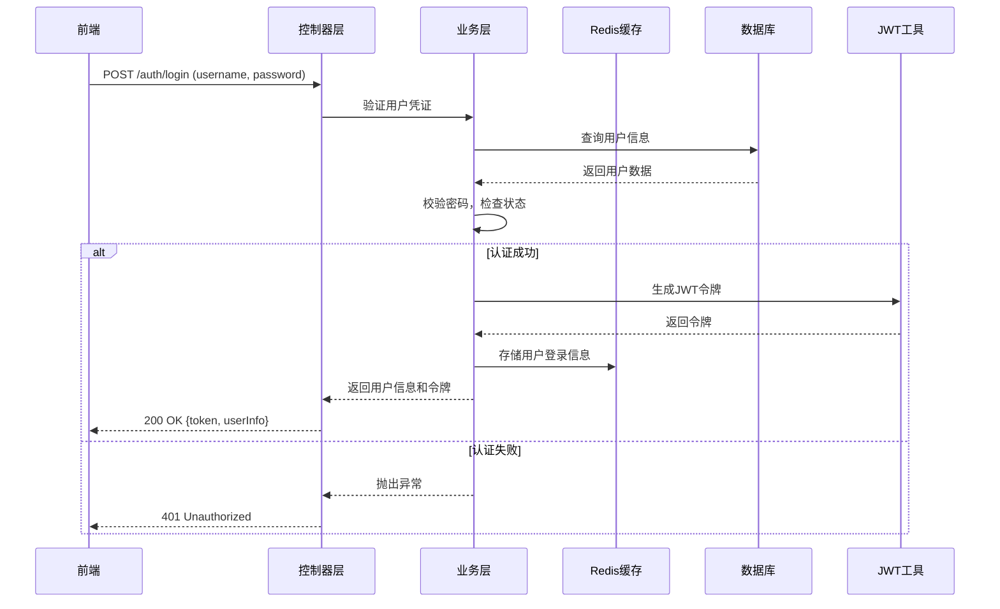
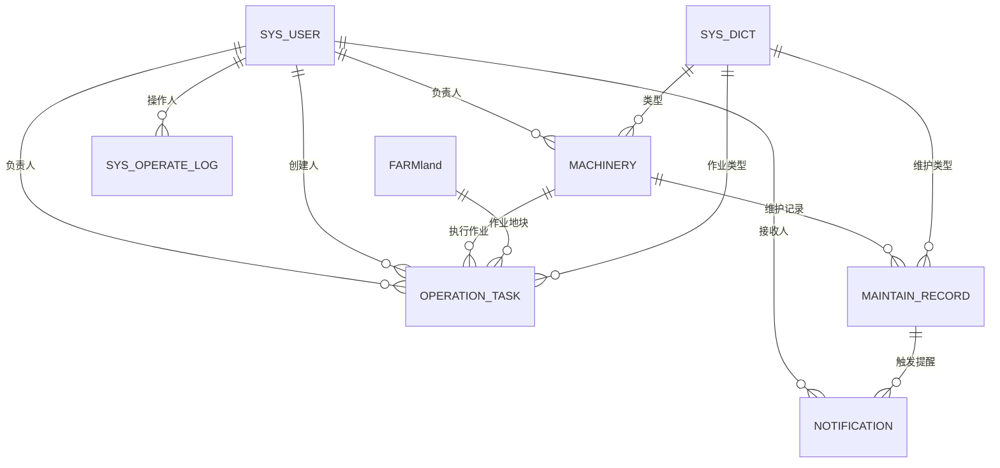

# 农业机械管理系统（AgriMachineryManager）详细技术文档

## 1. 项目概述

### 1.1 项目背景
随着农业现代化进程的加快，农业机械在农业生产中的应用越来越广泛。然而，传统的农机管理方式存在诸多问题：档案管理混乱、设备调度不合理、维护保养不及时、运行数据缺乏分析等，严重影响了农机的使用效率和寿命。农业机械管理系统通过信息化、数字化手段，实现对农机全生命周期的科学管理，提高农业生产效率。

### 1.2 系统目标
- 建立完善的农机档案管理体系，实现农机信息的集中管理
- 实现农机作业任务的智能化调度，提高农机利用率
- 提供农机维护维修全生命周期管理，延长设备使用寿命
- 建立科学的绩效考核和统计分析机制，提升管理决策水平
- 确保系统数据安全和用户权限精细控制
- 提供直观、易用的用户界面，降低使用门槛

### 1.3 系统特点
- **模块化设计**：采用清晰的模块划分，便于功能扩展和维护
- **高度集成**：整合农机管理、作业调度、维护记录等核心功能
- **数据驱动**：基于大数据分析，提供智能化决策支持
- **安全可靠**：采用JWT认证和Redis缓存，确保系统安全稳定运行
- **易扩展性**：支持未来功能扩展和技术升级

## 2. 技术架构

### 2.1 后端技术栈
- **基础框架**：Spring Boot 3.x
- **安全认证**：Spring Security + JWT (JSON Web Token)
- **数据库访问**：MyBatis-Plus 3.x
- **ORM框架**：MyBatis
- **API文档**：Knife4j (基于Swagger 3.0)
- **数据存储**：MySQL 8.x
- **缓存系统**：Redis 6.x
- **日志框架**：SLF4J + Logback
- **工具类库**：Lombok, Hutool
- **构建工具**：Maven

### 2.2 系统架构图
```
┌─────────────────┐
│   前端应用层    │
│  (Vue/React)    │
└────────┬────────┘
         │
┌────────▼────────┐
│    API网关层    │
│ (可选：Spring Cloud Gateway) │
└────────┬────────┘
         │
┌────────▼────────┐
│    控制层        │
│  (Controller)   │
└────────┬────────┘
         │
┌────────▼────────┐
│    业务逻辑层     │
│   (Service)     │
└────────┬────────┘
         │
┌────────▼────────┐
│    数据访问层     │
│  (Mapper/DAO)   │
└────────┬────────┘
         │
┌────────▼────────┐    ┌───────────────┐
│    数据库        │    │    Redis缓存   │
│  (MySQL)        │◄───►               │
└─────────────────┘    └───────────────┘
```

### 2.3 分层架构设计
- **表示层（Controller）**：处理HTTP请求，参数验证，返回响应
- **业务逻辑层（Service）**：实现核心业务逻辑，事务管理
- **数据访问层（Mapper）**：与数据库交互，CRUD操作
- **实体层（Entity）**：数据模型定义，与数据库表映射
- **传输对象层（DTO/VO）**：前后端数据交互的对象
- **通用组件层（Common）**：工具类、常量、异常处理等
- **配置层（Config）**：系统配置，如安全配置、数据库配置等

### 2.4 核心流程图

#### 2.4.1 用户认证流程


## 3. 系统配置

### 3.1 服务配置
- **服务端口**：8080
- **Context-Path**：无额外前缀
- **允许循环引用**：已启用 (allow-circular-references: true)

### 3.2 数据库配置
- **数据库类型**：MySQL 8.x
- **数据库名称**：agricultural_machinery_db
- **连接字符串**：`jdbc:mysql://localhost:3306/agricultural_machinery_db?useUnicode=true&characterEncoding=utf-8&useSSL=false&serverTimezone=Asia/Shanghai&allowPublicKeyRetrieval=true`
- **用户名**：root
- **密码**：root
- **连接池**：HikariCP
  - 最大连接数：10
  - 最小空闲连接数：5
  - 空闲超时时间：300000ms
  - 连接超时时间：20000ms
  - 最大生命周期：1800000ms

### 3.3 Redis缓存配置
- **主机地址**：localhost
- **端口**：6379
- **密码**：无
- **数据库索引**：0
- **连接超时**：3000ms
- **连接池配置**：
  - 最大活跃连接数：8
  - 最大等待时间：-1ms（无限等待）
  - 最大空闲连接数：8
  - 最小空闲连接数：0

### 3.4 MyBatis-Plus配置
- **Mapper XML文件位置**：`classpath*:mapper/**/*.xml`
- **实体类包路径**：`org.agrimachinerymanager.entity`
- **配置项**：
  - 下划线转驼峰命名：已启用
  - 主键策略：自动增长

### 3.5 JWT配置
- **签名密钥**：`agrimachinery-manager-2024-secure-key-long-enough-for-hs512-algorithm-complex-password-12345678`
- **令牌过期时间**：7天（604800秒）
- **令牌前缀**：Bearer

### 3.6 安全配置
- **登录接口**：`/auth/login`（允许匿名访问）
- **登出接口**：`/auth/logout`（允许匿名访问）
- **API文档接口**：`/doc.html`（允许匿名访问）
- **其他接口**：需要JWT认证
- **权限控制**：基于Spring Security的角色权限控制
- **密码加密**：使用BCrypt

## 4. 核心功能模块

### 4.1 用户认证管理

#### 4.1.1 登录功能
- **接口路径**：`POST /auth/login`
- **请求参数**：
  ```json
  {
    "username": "admin",  // 登录账号（必填）
    "password": "123456"  // 登录密码（必填）
  }
  ```
- **返回数据**：
  ```json
  {
    "code": 200,
    "message": "成功",
    "data": {
      "id": 1,
      "username": "admin",
      "realName": "系统管理员",
      "role": 1,  // 1-管理员，2-操作员
      "status": 1,
      "token": "eyJhbGciOiJIUzI1NiJ9...",
      "tokenType": "Bearer"
    }
  }
  ```
- **业务流程**：
  1. 验证用户名密码
  2. 检查用户状态
  3. 生成JWT令牌
  4. 存储登录信息到Redis
  5. 返回用户信息和令牌

#### 4.1.2 登出功能
- **接口路径**：`POST /auth/logout`
- **请求头**：`Authorization: Bearer {token}`
- **返回数据**：
  ```json
  {
    "code": 200,
    "message": "成功",
    "data": "退出登录成功"
  }
  ```
- **业务流程**：
  1. 从请求头获取JWT令牌
  2. 将令牌加入黑名单
  3. 从Redis删除用户登录信息
  4. 清除Security上下文
  5. 返回登出成功消息

#### 4.1.3 获取当前用户信息
- **接口路径**：`GET /auth/currentUser`
- **请求头**：`Authorization: Bearer {token}`
- **返回数据**：当前登录用户的详细信息

### 4.2 系统用户管理

#### 4.2.1 用户列表查询
- **接口路径**：`GET /sys-user/getSysUserPage`
- **请求参数**：
  - `pageNum`：页码（必填，默认1）
  - `pageSize`：每页条数（必填，默认10）
  - `username`：用户名（可选，用于搜索）
  - `realName`：真实姓名（可选，用于搜索）
  - `role`：角色（可选，1-管理员，2-操作员）
  - `status`：状态（可选，0-禁用，1-正常）
- **权限要求**：管理员
- **返回数据**：分页用户列表

#### 4.2.2 新增用户
- **接口路径**：`POST /sys-user/addSysUser`
- **请求参数**：
  ```json
  {
    "username": "operator1",      // 用户名（必填，唯一）
    "password": "123456",        // 密码（必填，将被加密存储）
    "realName": "操作员1",       // 真实姓名（必填）
    "phone": "13800138000",      // 联系电话
    "role": 2,                    // 角色（必填，1-管理员，2-操作员）
    "status": 1                   // 状态（1-正常，0-禁用）
  }
  ```
- **权限要求**：管理员
- **业务流程**：
  1. 验证参数
  2. 检查用户名是否已存在
  3. 密码加密
  4. 保存用户信息
  5. 记录操作日志

#### 4.2.3 更新用户
- **接口路径**：`PUT /sys-user/updateSysUser`
- **请求参数**：与新增用户类似，但必须包含id
- **权限要求**：管理员
- **业务流程**：
  1. 验证参数
  2. 检查用户是否存在
  3. 更新用户信息
  4. 记录操作日志

#### 4.2.4 删除用户
- **接口路径**：`DELETE /sys-user/deleteSysUser/{id}`
- **权限要求**：管理员
- **业务流程**：
  1. 验证参数
  2. 检查用户是否存在
  3. 删除用户信息
  4. 记录操作日志

#### 4.2.5 获取用户详情
- **接口路径**：`GET /sys-user/getSysUserById/{id}`
- **权限要求**：管理员或当前用户查询自己

### 4.3 农机档案管理

#### 4.3.1 农机档案列表
- **接口路径**：`GET /machinery/getMachineryPage`
- **请求参数**：
  - `pageNum`：页码
  - `pageSize`：每页条数
  - `machineryCode`：农机编号（可选，搜索）
  - `typeCode`：农机类型（可选，筛选）
  - `brand`：品牌（可选，搜索）
  - `status`：状态（可选，筛选）
- **返回数据**：农机档案分页列表

#### 4.3.2 新增农机档案
- **接口路径**：`POST /machinery/addMachinery`
- **请求参数**：
  ```json
  {
    "machineryCode": "NM001",        // 农机编号（必填，唯一）
    "typeCode": "TRACTOR",          // 农机类型编码（必填）
    "brand": "东方红",              // 品牌
    "model": "LX1204",             // 型号
    "factoryNumber": "DFH2023001",  // 出厂编号
    "buyDate": "2023-01-15",        // 购买日期
    "power": 120,                    // 额定功率(kW)
    "department": "第一作业队",     // 归属部门
    "responsibleUserId": 2,          // 负责人ID
    "status": "NORMAL",             // 状态
    "photoUrl": "https://example.com/photo.jpg", // 农机照片URL
    "remark": "主要用于耕地作业"      // 备注
  }
  ```
- **业务流程**：
  1. 验证参数
  2. 检查农机编号是否已存在
  3. 保存农机信息
  4. 记录操作日志

#### 4.3.3 更新农机档案
- **接口路径**：`PUT /machinery/updateMachinery`
- **请求参数**：与新增类似，需包含id

#### 4.3.4 删除农机档案
- **接口路径**：`DELETE /machinery/deleteMachinery/{id}`
- **业务流程**：
  1. 验证农机是否存在
  2. 检查是否有关联的作业任务
  3. 删除农机信息
  4. 记录操作日志

#### 4.3.5 农机详情
- **接口路径**：`GET /machinery/getMachineryById/{id}`

### 4.4 地块信息管理

#### 4.4.1 地块列表
- **接口路径**：`GET /farmland/getFarmlandPage`
- **请求参数**：
  - `pageNum`：页码
  - `pageSize`：每页条数
  - `landCode`：地块编码（可选）
  - `name`：地块名称（可选，搜索）

#### 4.4.2 新增地块
- **接口路径**：`POST /farmland/addFarmland`
- **请求参数**：
  ```json
  {
    "landCode": "LD001",           // 地块编码（必填，唯一）
    "name": "东地块",             // 地块名称（必填）
    "area": 150.5,                 // 面积(亩)
    "location": "农场东部，靠近灌溉渠", // 位置描述
    "remark": "主要种植小麦"        // 备注
  }
  ```

#### 4.4.3 更新地块
- **接口路径**：`PUT /farmland/updateFarmland`

#### 4.4.4 删除地块
- **接口路径**：`DELETE /farmland/deleteFarmland/{id}`
- **业务流程**：
  1. 验证地块是否存在
  2. 检查是否有关联的作业任务
  3. 删除地块信息
  4. 记录操作日志

#### 4.4.5 获取地块详情
- **接口路径**：`GET /farmland/getFarmlandById/{id}`

### 4.5 作业调度任务管理

#### 4.5.1 任务列表
- **接口路径**：`GET /operation-task/getOperationTaskPage`
- **请求参数**：
  - `pageNum`：页码
  - `pageSize`：每页条数
  - `taskCode`：任务编码（可选）
  - `machineryId`：农机ID（可选）
  - `farmlandId`：地块ID（可选）
  - `operationType`：作业类型（可选）
  - `status`：任务状态（可选）
  - `responsibleUserId`：负责人ID（可选）
  - `startDate`：开始日期（可选）
  - `endDate`：结束日期（可选）
- **返回数据**：任务分页列表

#### 4.5.2 新增作业任务
- **接口路径**：`POST /operation-task/addOperationTask`
- **请求参数**：
  ```json
  {
    "taskCode": "TASK001",                  // 任务编码（必填，唯一）
    "machineryId": 1,                        // 农机ID（必填）
    "farmlandId": 1,                         // 地块ID（必填）
    "operationType": "CULTIVATE",           // 作业类型（必填）
    "planStartTime": "2024-05-10T08:00:00", // 计划开始时间
    "planEndTime": "2024-05-12T18:00:00",   // 计划结束时间
    "planQuantity": 150,                     // 计划作业量(亩)
    "responsibleUserId": 2,                  // 负责人ID
    "remark": "春季耕地作业"                  // 备注
  }
  ```
- **业务流程**：
  1. 验证参数
  2. 检查农机和地块是否存在
  3. 检查农机状态是否可用
  4. 检查时间是否有冲突
  5. 创建作业任务
  6. 记录操作日志

#### 4.5.3 更新作业任务
- **接口路径**：`PUT /operation-task/updateOperationTask`
- **功能**：更新任务信息，包括状态变更
- **业务流程**：
  1. 验证参数
  2. 检查任务是否存在
  3. 根据状态变更执行不同逻辑
  4. 更新任务信息
  5. 记录操作日志

#### 4.5.4 删除作业任务
- **接口路径**：`DELETE /operation-task/deleteOperationTask/{id}`
- **业务流程**：
  1. 验证任务是否存在
  2. 检查任务状态（已开始或已完成的任务不能删除）
  3. 删除任务信息
  4. 记录操作日志

#### 4.5.5 任务详情
- **接口路径**：`GET /operation-task/getOperationTaskById/{id}`

#### 4.5.6 根据农机ID查询任务
- **接口路径**：`GET /operation-task/getOperationTasksByMachineryId/{machineryId}`
- **功能**：查询指定农机的所有作业任务

#### 4.5.7 根据地块ID查询任务
- **接口路径**：`GET /operation-task/getOperationTasksByFarmlandId/{farmlandId}`
- **功能**：查询指定地块的所有作业任务

#### 4.5.8 根据状态查询任务
- **接口路径**：`GET /operation-task/getOperationTasksByStatus/{status}`
- **功能**：查询指定状态（1-待执行，2-执行中，3-已完成，4-已取消）的所有作业任务

#### 4.5.7 任务执行记录
- **接口路径**：`POST /operation-task/updateTaskStatus`
- **功能**：更新任务的实际开始时间、结束时间、作业量、油耗等信息
- **请求参数**：
  ```json
  {
    "id": 1,
    "actualStartTime": "2024-05-10T08:15:00", // 实际开始时间
    "actualEndTime": "2024-05-12T17:30:00",   // 实际结束时间
    "actualQuantity": 145.5,                   // 实际作业量(亩)
    "fuelConsumption": 125.0,                  // 实际油耗(L)
    "status": 3                                // 状态（3-已完成）
  }
  ```

### 4.6 农机维护记录管理

#### 4.6.1 维护记录列表
- **接口路径**：`GET /maintain-record/getMaintainRecordPage`
- **请求参数**：
  - `pageNum`：页码（必填）
  - `pageSize`：每页条数（必填）
  - `machineryId`：农机ID（可选）
  - `maintainType`：维护类型（可选）
  - `maintainer`：维护人员（可选）
  - `createUserId`：创建人ID（可选）
  - `startTime`：开始时间（可选）
  - `endTime`：结束时间（可选）
  - `description`：维护描述（可选）
  - `minCost`：最小费用（可选）
  - `maxCost`：最大费用（可选）

#### 4.6.2 新增维护记录
- **接口路径**：`POST /maintain-record/addMaintainRecord`
- **请求参数**：
  ```json
  {
    "machineryId": 1,                     // 农机ID（必填）
    "maintainType": "REGULAR",           // 维护类型（必填）
    "maintainTime": "2024-04-20T10:30:00", // 维护时间（必填）
    "parts": "机油,滤芯,刹车片",          // 更换配件（多个用逗号分隔）
    "cost": 1200.50,                      // 维护费用（元）
    "maintainer": "张师傅",               // 维护人员
    "nextMaintainTime": "2024-10-20",    // 下次维护时间
    "nextMaintainCycle": 180,             // 下次维护周期（天）
    "description": "定期保养，更换机油和滤芯" // 维护描述
  }
  ```
- **业务流程**：
  1. 验证参数
  2. 检查农机是否存在
  3. 保存维护记录
  4. 自动计算下次维护时间（如果提供了维护周期）
  5. 生成维护提醒通知
  6. 记录操作日志

#### 4.6.3 更新维护记录
- **接口路径**：`PUT /maintain-record/updateMaintainRecord`

#### 4.6.4 删除维护记录
- **接口路径**：`DELETE /maintain-record/deleteMaintainRecord/{id}`

#### 4.6.5 维护记录详情
- **接口路径**：`GET /maintain-record/getMaintainRecordById/{id}`

#### 4.6.6 根据农机ID查询维护记录
- **接口路径**：`GET /maintain-record/getMaintainRecordsByMachineryId/{machineryId}`
- **功能**：查询指定农机的所有维护记录

#### 4.6.7 根据维护类型查询维护记录
- **接口路径**：`GET /maintain-record/getMaintainRecordsByType/{maintainType}`
- **功能**：查询指定维护类型的所有维护记录

#### 4.6.8 根据创建人ID查询维护记录
- **接口路径**：`GET /maintain-record/getMaintainRecordsByCreateUserId/{createUserId}`
- **功能**：查询指定创建人的所有维护记录

#### 4.6.9 根据维护时间范围查询维护记录
- **接口路径**：`GET /maintain-record/getMaintainRecordsByTimeRange`
- **请求参数**：
  - `startTime`：开始时间（必填）
  - `endTime`：结束时间（必填）
- **功能**：查询指定时间范围内的所有维护记录

### 4.7 通知提醒管理

#### 4.7.1 通知列表
- **接口路径**：`GET /notification/getNotificationPage`
- **请求参数**：
  - `pageNum`：页码（必填）
  - `pageSize`：每页条数（必填）
  - `userId`：用户ID（可选）
  - `isRead`：是否已读（可选，0-未读，1-已读）
  - `relatedModule`：关联模块（可选）
  - `relatedId`：关联ID（可选）

#### 4.7.2 新增通知
- **接口路径**：`POST /notification/addNotification`
- **请求参数**：
  ```json
  {
    "title": "维护提醒",                  // 通知标题（必填）
    "content": "东方红LX1204将于3天后需要进行定期维护", // 通知内容（必填）
    "relatedId": 1,                       // 关联ID（如农机ID）
    "relatedModule": "maintain",         // 关联模块
    "userId": 2                           // 接收人ID（必填）
  }
  ```

#### 4.7.3 标记通知已读
- **接口路径**：`PUT /notification/markNotificationAsRead/{id}`
- **功能**：将通知标记为已读

#### 4.7.4 删除通知
- **接口路径**：`DELETE /notification/deleteNotification/{id}`

#### 4.7.5 通知详情
- **接口路径**：`GET /notification/getNotificationById/{id}`

#### 4.7.6 获取未读通知数量
- **接口路径**：`GET /notification/getUnreadCount`
- **功能**：获取当前用户的未读通知数量

#### 4.7.7 根据用户ID获取通知
- **接口路径**：`GET /notification/getNotificationsByUserId/{userId}`
- **功能**：查询指定用户的所有通知提醒

### 4.8 数据字典管理

#### 4.8.1 字典列表
- **接口路径**：`GET /sys-dict/getSysDictPage`
- **请求参数**：
  - `pageNum`：页码（必填）
  - `pageSize`：每页条数（必填）
  - `type`：字典类型（可选）
  - `code`：字典编码（可选）
  - `name`：字典名称（可选）

#### 4.8.2 新增字典
- **接口路径**：`POST /sys-dict/addSysDict`
- **请求参数**：
  ```json
  {
    "type": "MACHINERY_TYPE", // 字典类型（必填）
    "code": "TRACTOR",       // 字典编码（必填）
    "name": "拖拉机",        // 字典名称（必填）
    "sort": 1,               // 排序
    "remark": "农机类型"      // 备注
  }
  ```

#### 4.8.3 根据类型获取字典
- **接口路径**：`GET /sys-dict/getSysDictByType/{type}`
- **功能**：获取指定类型的字典数据（如农机类型、作业类型等）

#### 4.8.4 根据类型和编码获取字典
- **接口路径**：`GET /sys-dict/getSysDictByTypeAndCode`
- **请求参数**：
  - `type`：字典类型（必填）
  - `code`：字典编码（必填）

#### 4.8.5 根据多个类型获取字典
- **接口路径**：`POST /sys-dict/getByTypes`
- **请求参数**：类型列表

### 4.9 系统操作日志管理

#### 4.9.1 日志列表
- **接口路径**：`GET /sys-operate-log/getSysOperateLogPage`
- **请求参数**：
  - `pageNum`：页码（必填，默认1）
  - `pageSize`：每页条数（必填，默认10）
  - `userId`：操作用户ID（可选）
  - `operateType`：操作类型（可选）
  - `operateModule`：操作模块（可选）
  - `operateContent`：操作内容（可选）
  - `startTime`：开始时间（可选）
  - `endTime`：结束时间（可选）
  - `operateIp`：操作IP（可选）

#### 4.9.2 日志详情
- **接口路径**：`GET /sys-operate-log/getSysOperateLogById/{id}`

#### 4.9.3 根据用户ID查询日志
- **接口路径**：`GET /sys-operate-log/getSysOperateLogsByUserId/{userId}`

#### 4.9.4 根据操作类型查询日志
- **接口路径**：`GET /sys-operate-log/getSysOperateLogsByType/{operateType}`
- **功能**：查询指定操作类型的所有系统操作日志

#### 4.9.5 根据操作模块查询日志
- **接口路径**：`GET /sys-operate-log/getSysOperateLogsByModule/{operateModule}`
- **功能**：查询指定操作模块的所有系统操作日志

## 5. 数据模型

### 5.1 实体关系图


### 5.2 SysUser（系统用户表）
| 字段名 | 数据类型 | 描述 | 约束 |
|-------|---------|------|------|
| id | BIGINT | 用户ID | 主键，自增 |
| username | VARCHAR(50) | 登录账号 | 唯一，非空 |
| password | VARCHAR(255) | 加密密码 | 非空，使用BCrypt加密 |
| realName | VARCHAR(50) | 真实姓名 | 非空 |
| phone | VARCHAR(20) | 联系电话 | |
| role | INT | 角色 | 1-管理员，2-操作员 |
| status | INT | 状态 | 0-禁用，1-正常 |
| createTime | DATETIME | 创建时间 | |
| updateTime | DATETIME | 更新时间 | |

### 5.3 Machinery（农机档案表）
| 字段名 | 数据类型 | 描述 | 约束 |
|-------|---------|------|------|
| id | BIGINT | 农机ID | 主键，自增 |
| machineryCode | VARCHAR(50) | 农机编号 | 唯一，非空 |
| typeCode | VARCHAR(50) | 农机类型编码 | 非空，关联sys_dict |
| brand | VARCHAR(50) | 品牌 | |
| model | VARCHAR(50) | 型号 | |
| factoryNumber | VARCHAR(50) | 出厂编号 | |
| buyDate | DATE | 购买日期 | |
| power | DECIMAL(10,2) | 额定功率(kW) | |
| department | VARCHAR(100) | 归属部门 | |
| responsibleUserId | BIGINT | 负责人ID | 关联sys_user |
| status | VARCHAR(20) | 状态 | 关联sys_dict（NORMAL-正常，MAINTAIN-维护中，FAULT-故障） |
| photoUrl | VARCHAR(255) | 农机照片URL | |
| remark | TEXT | 备注 | |
| createTime | DATETIME | 创建时间 | |
| updateTime | DATETIME | 更新时间 | |

### 5.4 Farmland（地块信息表）
| 字段名 | 数据类型 | 描述 | 约束 |
|-------|---------|------|------|
| id | BIGINT | 地块ID | 主键，自增 |
| landCode | VARCHAR(50) | 地块编码 | 唯一，非空 |
| name | VARCHAR(100) | 地块名称 | 非空 |
| area | DECIMAL(10,2) | 面积(亩) | |
| location | VARCHAR(255) | 位置描述 | |
| remark | TEXT | 备注 | |
| createTime | DATETIME | 创建时间 | |
| updateTime | DATETIME | 更新时间 | |

### 5.5 OperationTask（作业调度任务表）
| 字段名 | 数据类型 | 描述 | 约束 |
|-------|---------|------|------|
| id | BIGINT | 任务ID | 主键，自增 |
| taskCode | VARCHAR(50) | 任务编码 | 唯一，非空 |
| machineryId | BIGINT | 农机ID | 非空，关联machinery |
| farmlandId | BIGINT | 地块ID | 非空，关联farmland |
| operationType | VARCHAR(50) | 作业类型编码 | 非空，关联sys_dict（CULTIVATE-耕地，SOW-播种，HARVEST-收割，TRANSPORT-运输） |
| planStartTime | DATETIME | 计划开始时间 | |
| planEndTime | DATETIME | 计划结束时间 | |
| planQuantity | DECIMAL(10,2) | 计划作业量(亩) | |
| actualStartTime | DATETIME | 实际开始时间 | |
| actualEndTime | DATETIME | 实际结束时间 | |
| actualQuantity | DECIMAL(10,2) | 实际作业量(亩) | |
| fuelConsumption | DECIMAL(10,2) | 实际油耗(L) | |
| status | INT | 状态 | 1-待执行，2-执行中，3-已完成，4-已取消 |
| responsibleUserId | BIGINT | 负责人ID | 关联sys_user |
| createUserId | BIGINT | 创建人ID | 关联sys_user |
| remark | TEXT | 备注 | |
| createTime | DATETIME | 创建时间 | |
| updateTime | DATETIME | 更新时间 | |

### 5.6 MaintainRecord（农机维护记录表）
| 字段名 | 数据类型 | 描述 | 约束 |
|-------|---------|------|------|
| id | BIGINT | 记录ID | 主键，自增 |
| machineryId | BIGINT | 农机ID | 非空，关联machinery |
| maintainType | VARCHAR(50) | 维护类型编码 | 非空，关联sys_dict（REGULAR-定期保养，REPAIR-维修，EMERGENCY-紧急维修） |
| maintainTime | DATETIME | 维护时间 | |
| parts | TEXT | 更换配件（多个用逗号分隔） | |
| cost | DECIMAL(10,2) | 维护费用（元） | |
| maintainer | VARCHAR(50) | 维护人员 | |
| nextMaintainTime | DATE | 下次维护时间 | |
| nextMaintainCycle | INT | 下次维护周期（天） | |
| description | TEXT | 维护描述（故障原因/保养内容） | |
| createUserId | BIGINT | 创建人ID | 关联sys_user |
| createTime | DATETIME | 创建时间 | |
| updateTime | DATETIME | 更新时间 | |

### 5.7 Notification（通知提醒表）
| 字段名 | 数据类型 | 描述 | 约束 |
|-------|---------|------|------|
| id | BIGINT | 通知ID | 主键，自增 |
| title | VARCHAR(200) | 通知标题 | 非空 |
| content | TEXT | 通知内容 | 非空 |
| relatedId | BIGINT | 关联ID（如农机ID） | |
| relatedModule | VARCHAR(50) | 关联模块 | maintain-维护提醒，task-任务提醒 |
| userId | BIGINT | 接收人ID | 非空，关联sys_user |
| isRead | INT | 是否已读 | 0-未读，1-已读，默认0 |
| createTime | DATETIME | 创建时间 | |

### 5.8 SysDict（数据字典表）
| 字段名 | 数据类型 | 描述 | 约束 |
|-------|---------|------|------|
| id | BIGINT | 字典ID | 主键，自增 |
| type | VARCHAR(50) | 字典类型编码 | 非空，如MACHINERY_TYPE, OPERATION_TYPE |
| code | VARCHAR(50) | 字典编码 | 非空，如TRACTOR, CULTIVATE |
| name | VARCHAR(200) | 字典名称 | 非空，如拖拉机、耕地 |
| sort | INT | 排序 | 默认0 |
| status | INT | 状态 | 1-启用，0-禁用，默认1 |
| remark | VARCHAR(255) | 备注 | |
| createTime | DATETIME | 创建时间 | |
| updateTime | DATETIME | 更新时间 | |

### 5.9 SysOperateLog（系统操作日志表）
| 字段名 | 数据类型 | 描述 | 约束 |
|-------|---------|------|------|
| id | BIGINT | 日志ID | 主键，自增 |
| userId | BIGINT | 操作用户ID | 关联sys_user |
| username | VARCHAR(50) | 操作用户名 | |
| operateType | VARCHAR(50) | 操作类型 | ADD-新增，UPDATE-更新，DELETE-删除，QUERY-查询，LOGIN-登录，LOGOUT-登出 |
| operateModule | VARCHAR(100) | 操作模块 | 如machinery, operation-task, sys-user |
| operateContent | TEXT | 操作内容 | 详细的操作描述 |
| operateIp | VARCHAR(50) | 操作IP | |
| operateTime | DATETIME | 操作时间 | |

### 5.10 常用数据字典类型

| 字典类型 | 字典编码 | 字典名称 |
|---------|---------|--------|
| MACHINERY_TYPE | TRACTOR | 拖拉机 |
| MACHINERY_TYPE | COMBINE_HARVESTER | 联合收割机 |
| MACHINERY_TYPE | PLANTER | 播种机 |
| MACHINERY_TYPE | SPRAYER | 喷雾机 |
| MACHINERY_STATUS | NORMAL | 正常 |
| MACHINERY_STATUS | MAINTAIN | 维护中 |
| MACHINERY_STATUS | FAULT | 故障 |
| OPERATION_TYPE | CULTIVATE | 耕地 |
| OPERATION_TYPE | SOW | 播种 |
| OPERATION_TYPE | HARVEST | 收割 |
| OPERATION_TYPE | TRANSPORT | 运输 |
| TASK_STATUS | 1 | 待执行 |
| TASK_STATUS | 2 | 执行中 |
| TASK_STATUS | 3 | 已完成 |
| TASK_STATUS | 4 | 已取消 |
| MAINTAIN_TYPE | REGULAR | 定期保养 |
| MAINTAIN_TYPE | REPAIR | 维修 |
| MAINTAIN_TYPE | EMERGENCY | 紧急维修 |
| USER_ROLE | 1 | 管理员 |
| USER_ROLE | 2 | 操作员 |

## 6. API接口规范

### 6.1 接口响应格式
所有接口返回统一格式：
```json
{
  "code": 200,      // 状态码，200表示成功，其他表示失败
  "message": "成功", // 响应消息
  "data": {}        // 响应数据，成功时返回具体数据，失败时可为null
}
```

### 6.2 状态码定义
- `200`：操作成功
- `400`：请求参数错误
- `401`：未授权，需要登录
- `403`：拒绝访问，权限不足
- `404`：资源不存在
- `500`：服务器内部错误

### 6.3 请求方法规范
- `GET`：查询操作
- `POST`：新增操作
- `PUT`：更新操作
- `DELETE`：删除操作

### 6.4 URL命名规范
- 使用小写字母和连字符(-)分隔单词
- 模块名使用复数形式（如sys-users）
- 接口路径格式：`/{模块名}/{操作}`
- 示例：`/sys-user/list`、`/machinery/addMachinery`

### 6.5 请求头规范
- 认证请求头：`Authorization: Bearer {token}`
- Content-Type：`application/json`
- Accept：`application/json`

## 7. 安全设计

### 7.1 认证机制
- 基于JWT的无状态认证
- 登录时生成JWT令牌，包含用户ID、用户名、角色等信息
- 令牌有效期为7天
- 支持令牌黑名单机制，登出时将令牌加入黑名单

### 7.2 授权机制
- 基于Spring Security的角色权限控制
- 使用`@PreAuthorize`注解控制方法级别的访问权限
- 管理员（role=1）拥有所有权限
- 操作员（role=2）拥有基本的农机管理和任务执行权限

### 7.2.1 角色权限详情

#### 7.2.1.1 管理员角色(ADMIN)
- ALL_ACCESS：所有访问权限
- MANAGE_USERS：用户管理权限
- MANAGE_MACHINES：农机管理权限
- VIEW_REPORTS：报表查看权限

#### 7.2.1.2 操作员角色(OPERATOR)
- OPERATE_MACHINES：农机操作权限
- VIEW_MACHINES：农机查看权限
- VIEW_REPORTS：报表查看权限

### 7.3 数据安全
- 密码使用BCrypt算法加密存储
- 敏感信息传输使用HTTPS
- 输入参数验证，防止SQL注入和XSS攻击
- 日志记录操作，但不记录敏感信息

### 7.4 会话管理
- 使用Redis存储用户登录信息和会话状态
- 支持多终端登录管理
- 支持强制下线功能

## 8. 前端开发指南

### 8.1 技术选型建议
- **前端框架**：Vue 3 + Vite
- **UI组件库**：Element Plus
- **HTTP客户端**：Axios
- **状态管理**：Pinia
- **路由管理**：Vue Router
- **图表组件**：ECharts
- **富文本编辑器**：TinyMCE
- **表格组件**：Element Plus Table

### 8.2 项目结构建议
```
src/
├── api/             # API接口封装
├── assets/          # 静态资源
├── components/      # 公共组件
├── layout/          # 布局组件
├── router/          # 路由配置
├── store/           # 状态管理
├── utils/           # 工具函数
├── views/           # 页面组件
│   ├── auth/        # 认证相关页面
│   ├── machinery/   # 农机管理页面
│   ├── farmland/    # 地块管理页面
│   ├── task/        # 作业任务页面
│   ├── maintain/    # 维护记录页面
│   ├── notification/ # 通知提醒页面
│   ├── sys/         # 系统管理页面
│   └── dashboard/   # 仪表板页面
├── App.vue          # 根组件
└── main.js          # 入口文件
```

### 8.3 认证流程实现

#### 8.3.1 Axios拦截器配置
```javascript
// 创建axios实例
const service = axios.create({
  baseURL: '/api',
  timeout: 5000
})

// 请求拦截器
service.interceptors.request.use(
  config => {
    // 从localStorage获取token
    const token = localStorage.getItem('token')
    // 如果token存在，添加到请求头
    if (token) {
      config.headers['Authorization'] = `Bearer ${token}`
    }
    return config
  },
  error => {
    return Promise.reject(error)
  }
)

// 响应拦截器
service.interceptors.response.use(
  response => {
    const res = response.data
    // 如果状态码不是200，判断为错误
    if (res.code !== 200) {
      // 处理各种错误码
      if (res.code === 401) {
        // 未授权，清除token并重定向到登录页
        localStorage.removeItem('token')
        router.push('/login')
      } else if (res.code === 403) {
        ElMessage.error('权限不足')
      } else {
        ElMessage.error(res.message || '请求失败')
      }
      return Promise.reject(new Error(res.message || '请求失败'))
    }
    return res
  },
  error => {
    // 处理网络错误等
    ElMessage.error('网络错误，请稍后重试')
    return Promise.reject(error)
  }
)

export default service
```

#### 8.3.2 登录页面实现
```vue
<template>
  <div class="login-container">
    <el-card class="login-card">
      <template #header>
        <div class="login-header">
          <h2>农业机械管理系统</h2>
        </div>
      </template>
      <el-form :model="loginForm" :rules="loginRules" ref="loginFormRef">
        <el-form-item prop="username">
          <el-input v-model="loginForm.username" placeholder="用户名" prefix-icon="el-icon-user" />
        </el-form-item>
        <el-form-item prop="password">
          <el-input v-model="loginForm.password" type="password" placeholder="密码" prefix-icon="el-icon-lock" />
        </el-form-item>
        <el-form-item>
          <el-button type="primary" class="login-btn" @click="handleLogin" :loading="loading">
            登录
          </el-button>
        </el-form-item>
      </el-form>
    </el-card>
  </div>
</template>

<script>
import { ref, reactive } from 'vue'
import { ElMessage } from 'element-plus'
import { useRouter } from 'vue-router'
import loginApi from '@/api/auth'

export default {
  setup() {
    const router = useRouter()
    const loading = ref(false)
    const loginFormRef = ref()
    
    const loginForm = reactive({
      username: '',
      password: ''
    })
    
    const loginRules = {
      username: [
        { required: true, message: '请输入用户名', trigger: 'blur' }
      ],
      password: [
        { required: true, message: '请输入密码', trigger: 'blur' }
      ]
    }
    
    const handleLogin = async () => {
      try {
        await loginFormRef.value.validate()
        loading.value = true
        const res = await loginApi.login(loginForm)
        if (res.code === 200) {
          // 存储token和用户信息
          localStorage.setItem('token', res.data.token)
          localStorage.setItem('userInfo', JSON.stringify(res.data))
          ElMessage.success('登录成功')
          // 跳转到首页
          router.push('/')
        }
      } catch (error) {
        console.error('登录失败', error)
      } finally {
        loading.value = false
      }
    }
    
    return {
      loginForm,
      loginRules,
      loginFormRef,
      loading,
      handleLogin
    }
  }
}
</script>
```

### 8.4 仪表板页面实现建议
仪表板应包含以下内容：
- 系统概览数据（农机数量、任务数量、维护记录等）
- 待办任务列表
- 近期作业任务甘特图
- 农机状态分布图表
- 操作日志最新记录
- 通知提醒列表

### 8.5 农机管理页面实现建议
- 农机列表表格，支持分页、筛选、排序
- 农机详情查看弹窗
- 农机新增/编辑表单
- 农机状态快速切换
- 关联数据展示（维护记录、作业任务）

### 8.6 作业任务页面实现建议
- 任务列表，支持多条件筛选
- 甘特图展示任务时间线
- 拖拽调整任务时间（可选）
- 任务状态流转界面
- 任务执行记录录入表单

### 8.7 组件开发规范
- 使用Vue 3 Composition API
- 组件命名使用kebab-case
- 样式使用scoped或CSS Modules
- 组件拆分遵循单一职责原则
- 提供完善的props类型定义

## 9. 部署说明

### 9.1 环境要求
- JDK 17+
- MySQL 8.x
- Redis 6.x
- Maven 3.8+
- Node.js 16+
- Nginx（可选，用于前端部署）

### 9.2 数据库初始化
- 导入数据库脚本创建数据库和表结构
- 初始化基础数据（如管理员账号、字典数据等）

### 9.3 后端部署

#### 9.3.1 编译打包
```bash
# 克隆代码
git clone <repository-url>
cd AgriMachineryManager

# 编译打包
mvn clean package -DskipTests
```

#### 9.3.2 运行jar包
```bash
java -jar target/AgriMachineryManager.jar
```

#### 9.3.3 使用Docker部署（可选）
```dockerfile
FROM openjdk:17-jdk-slim
WORKDIR /app
COPY target/AgriMachineryManager.jar /app/
EXPOSE 8080
ENTRYPOINT ["java", "-jar", "AgriMachineryManager.jar"]
```

### 9.4 前端部署

#### 9.4.1 构建前端
```bash
cd frontend
npm install
npm run build
```

#### 9.4.2 Nginx配置示例
```nginx
server {
    listen 80;
    server_name example.com;
    
    location / {
        root /path/to/dist;
        index index.html;
        try_files $uri $uri/ /index.html;
    }
    
    location /api {
        proxy_pass http://localhost:8080;
        proxy_set_header Host $host;
        proxy_set_header X-Real-IP $remote_addr;
        proxy_set_header X-Forwarded-For $proxy_add_x_forwarded_for;
    }
}
```

## 10. 开发建议

### 10.1 代码规范
- 遵循Java编码规范和命名约定
- 使用Lombok减少模板代码
- 添加适当的注释
- 日志记录关键操作和异常

### 10.2 性能优化
- 合理使用Redis缓存热点数据
- 数据库查询添加索引
- 使用分页查询减少数据传输量
- 避免N+1查询问题

### 10.3 安全注意事项
- 敏感操作需要权限验证
- 防止SQL注入和XSS攻击
- 定期更新JWT密钥
- 密码复杂度要求

### 10.4 测试建议
- 单元测试覆盖核心业务逻辑
- 集成测试验证接口功能
- 性能测试确保系统响应速度

### 10.5 文档更新
- 代码变更时同步更新API文档
- 记录系统变更日志
- 维护数据库设计文档

## 11. 扩展功能规划

### 11.1 近期扩展功能
- 农机运行数据采集（油耗、工时等）
- 移动端应用开发（Android/iOS）
- 报表统计功能增强
- 短信/微信通知集成

### 11.2 远期扩展功能
- 农机定位追踪功能（基于GPS）
- 故障预警和诊断系统（AI辅助）
- 智能调度算法优化
- 大数据分析和智能决策支持
- 多租户支持
- 微服务架构改造